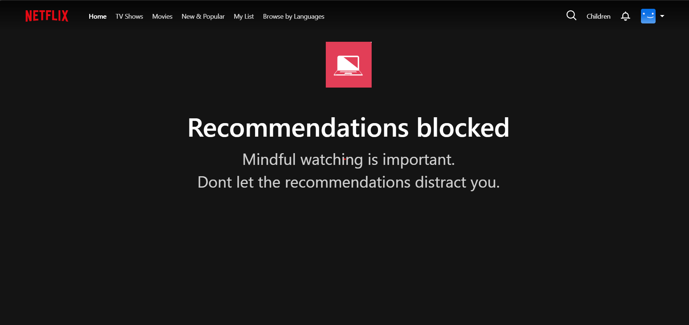

# NetFix Chrome Extension

NetFix helps you take control of your Netflix viewing habits by providing tools to customize your browsing experience.

## Features

- **Hide Recommendations**: Remove auto-playing trailers and recommendation rows from the Netflix homepage
- **Search Without Distractions**: Recommendations remain visible on the search page for better usability
- **Customizable Settings**: Enable or disable features through an easy-to-use popup interface

## Documentation

Here's how NetFix transforms your Netflix experience:

### Before and After Comparison

#### NetFix watch stats

#### Settings page

#### Recommendations blocker

#### Viewing Limit Over

## Installation

### From Chrome Web Store
*(Coming Soon)*

### Manual Installation
1. Download or clone this repository
2. Open Chrome and navigate to `chrome://extensions/`
3. Enable "Developer mode" in the top right corner
4. Click "Load unpacked" and select the `dist/netfix` directory

## Development

### Prerequisites
- Node.js (v14 or higher)
- npm or yarn

### Setup
1. Install dependencies
`npm install`
2. Run the extension
`npm run dev`
`npm run build:extension`

## Contributing

1. Fork the repository
2. Create your feature branch (`git checkout -b feature/amazing-feature`)
3. Commit your changes (`git commit -m 'Add some amazing feature'`)
4. Push to the branch (`git push origin feature/amazing-feature`)
5. Open a Pull Request

